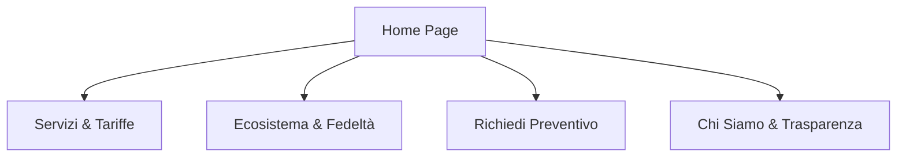

# Sitemap & Struttura delle Pagine: PrimeFactory

Questo documento definisce l'alberatura del sito vetrina di **PrimeFactory**, i contenuti chiave di ciascuna pagina e le best practice SEO per ottimizzare il posizionamento e l'esperienza utente.

---

## 🗺️ Alberatura del Sito (Sitemap)

Il sito è strutturato per essere leggero, veloce e focalizzato sulla conversione (richiesta preventivo) e sull'educazione al riciclo.

---

## 📄 Dettaglio Pagine & Struttura Contenuti

### 1. Home Page (`index.php` / `index.html`)
*   **Obiettivo principale**: Catturare l'attenzione dell'utente, comunicare la combinazione unica di manifattura tecnica 3D + sostenibilità, e spingere all'azione (CTA principale: "Richiedi Preventivo").
*   **Contenuti chiave**:
    *   **Hero Section**: Headline forte orientata al valore ("La tua manifattura digitale, sostenibile e trasparente") + Subheadline esplicativa ("Stampa 3D professionale FDM e Resina, progettazione CAD e un ecosistema circolare che premia il tuo riciclo").
    *   **Sezione Filosofia / USP (Unique Selling Proposition)**: Tre colonne con icone (1. Alta Precisione, 2. Trasparenza Energetica, 3. Economia Circolare).
    *   **Quick Preview Servizi**: Sintesi visiva di FDM, Resina e Progettazione CAD con link di approfondimento.
    *   **Come Funziona il Riciclo (Teaser)**: Illustrazione grafica semplificata del ciclo della plastica e del guadagno di punti.
    *   **CTA Final (Social Proof / Trust)**: Invito a caricare il primo file 3D per un preventivo gratuito.
*   **SEO & Metadati**:
    *   `Title Tag`: Stampa 3D Professionale e Manifattura Circolare | PrimeFactory
    *   `Meta Description`: Servizi di stampa 3D FDM e Resina con progettazione CAD avanzata. Scopri il nostro modello circolare: ricicliamo i tuoi scarti e ti premiamo!
    *   `H1`: Stampa 3D Professionale, Progettazione CAD e Manifattura Circolare

---

### 2. Servizi & Tariffe (`servizi.php` / `servizi.html`)
*   **Obiettivo principale**: Spiegare chiaramente le capacità tecniche dell'officina, i materiali trattati e le logiche di calcolo del prezzo.
*   **Contenuti chiave**:
    *   **Tab Tecnologie**: Schede dettagliate per **FDM** (PLA, PETG, ABS, TPU) e **Resina** (Standard, Tecnica/Ingegneristica) con relativi casi d'uso consigliati.
    *   **Servizio CAD & Reverse Engineering**: Spiegazione di come aiutiamo chi non ha un file 3D pronto, partendo da un disegno cartaceo o un oggetto fisico rotto.
    *   **Trasparenza delle Tariffe**: Spiegazione di come calcoliamo i prezzi (Tempo di stampa + Costo materiale in grammi + Consumo energetico tracciato + Eventuale post-processing). Nessun costo nascosto.
*   **SEO & Metadati**:
    *   `Title Tag`: Servizi di Stampa 3D FDM, Resina e Modellazione CAD | PrimeFactory
    *   `Meta Description`: Scopri le nostre tecnologie di stampa 3D FDM e Resina. Preventivi trasparenti basati su materiali di qualità e tracciabilità energetica.
    *   `H1`: Servizi Professionali di Stampa 3D e Modellazione CAD

---

### 3. Ecosistema & Programma Fedeltà (`fedelta.php` / `fedelta.html`)
*   **Obiettivo principale**: Spiegare nei minimi dettagli le regole di accumulo punti, i vantaggi del riciclo, i livelli cliente e il sistema referral "Codice Amico".
*   **Contenuti chiave**:
    *   **Intro & Manifesto Green**: Perché ricicliamo la plastica di scarto della stampa 3D.
    *   **Regolamento Punti**: Schema chiaro 1€ = 10 punti; 1kg scarti = 100 punti.
    *   **Tabella dei Livelli (Bronze, Silver, Gold)**: Soglie di punti e sconti/priorità corrispondenti.
    *   **Sezione Referral (Codice Amico)**: Logica del bonus di invito per invitante (25 pt / sconto 30€ dopo 5 amici) ed invitato.
    *   **FAQ dedicate**: Risposte a domande frequenti (Es. "Che tipo di plastica da stampa fallita accettate?").
*   **SEO & Metadati**:
    *   `Title Tag`: Programma Fedeltà Green e Riciclo Plastica 3D | PrimeFactory
    *   `Meta Description`: Guadagna stampando in 3D. Porta i tuoi scarti o stampe fallite da riciclare, accumula punti fedeltà e sblocca sconti esclusivi Bronze, Silver e Gold.
    *   `H1`: Il Nostro Ecosistema Circolare: Guadagna Riciclando

---

### 4. Richiedi Preventivo (`preventivo.php` / `preventivo.html`)
*   **Obiettivo principale**: Raccogliere tutti i dati necessari per formulare un preventivo preciso e avviare l'onboarding del cliente (come guest).
*   **Contenuti chiave**:
    *   **Form Interattivo a 3 Step** (Vedi documento mockup specifico per i campi di input).
    *   **Box Informativo Laterale**: Rassicurazioni sulla privacy (crittografia UUID), tempi di risposta (solitamente entro 24 ore) e formati file accettati.
*   **SEO & Metadati**:
    *   `Title Tag`: Richiedi Preventivo Stampa 3D e Progettazione CAD | PrimeFactory
    *   `Meta Description`: Carica il tuo file 3D (STL, STEP, OBJ, IGS), scegli la tecnologia e il materiale. Ricevi un preventivo personalizzato e trasparente in 24 ore.
    *   `H1`: Richiedi un Preventivo Personalizzato

---

### 5. Chi Siamo & Trasparenza (`chi-siamo.php` / `chi-siamo.html`)
*   **Obiettivo principale**: Umanizzare il brand, mostrare il team/l'officina e spiegare come funziona il tracciamento energetico interno.
*   **Contenuti chiave**:
    *   **La Nostra Storia**: Chi siamo, la passione per la manifattura additiva e la scelta etica dell'economia circolare.
    *   **Trasparenza Energetica**: Come misuriamo l'assorbimento elettrico reale dei nostri estrusori e riscaldatori durante ogni ciclo di stampa per garantire che il cliente paghi solo l'energia effettivamente consumata (senza ricarichi arbitrari).
    *   **I Nostri Valori**: Sostenibilità locale, precisione meccanica, supporto post-vendita.
*   **SEO & Metadati**:
    *   `Title Tag`: Chi Siamo e Trasparenza Energetica | PrimeFactory
    *   `Meta Description`: Conosci l'officina digitale PrimeFactory. Scopri come uniamo la precisione tecnica della stampa 3D alla sostenibilità e al tracciamento dei consumi energetici.
    *   `H1`: Manifattura Digitale Trasparente ed Eco-Consapevole

---

## 🛠️ Linee Guida di Navigazione (Header & Footer)

*   **Header (Navigazione Principale)**:
    *   Logo (PrimeFactory)
    *   Link: Servizi & Tariffe | Ecosistema & Fedeltà | Chi Siamo | **CTA: Richiedi Preventivo** (Bottone in evidenza con micro-animazione).
*   **Footer**:
    *   Contatti rapidi (Email, Telefono, Indirizzo Officina per la consegna scarti).
    *   Link legali (Privacy Policy, Cookie Policy, Termini di Servizio).
    *   Badge "100% Green Energy" o "Circular Economy Partner".
